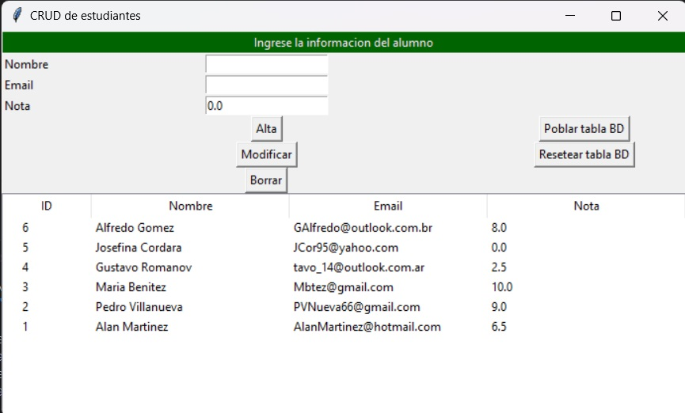

# Trabajo Practico Final :computer:
Este trabajo consiste en el desarrollo de un sistema de gestión de base de datos para alumnos de una institución educativa, que permite realizar operaciones de Crear, Leer, Actualizar y Eliminar (CRUD) información sobre los estudiantes. El sistema presenta una interfaz gráfica intuitiva que permite a los profesores ingresar de manera rápida y sencilla la información básica de los alumnos y registrar sus calificaciones.

## Instrucciones de Uso :page_with_curl:
#### Instalación:
Se recomienda utilizar la version de **Python 3.11.7**
#### Librerias Python:
Se recomiendan instalar las siguientes librerias:
* Sphinx == 7.2.6
* groundwork-sphinx-theme == 1.1.1
* peewee == 3.17.1

#### CRUD de estudiantes:

El proceso de uso del CRUD es sencillo. En el primer campo, se debe ingresar el nombre completo del alumno; en el segundo, su dirección de correo electrónico (se admiten solo textos varchar con el formato de correo electrónico estándar, es decir, una cadena de texto seguida de '@', seguida de otra cadena de texto, y finalizada con '.com'); y en el tercero, la calificación del alumno. Al dar de alta la información, se visualizará como una tabla en la parte inferior del tablero, con una columna adicional de ID que permite identificar cada registro.

Tambien tenemos las opciones de 'Borrar' y 'Modificar'. Para eliminar un registro, basta con seleccionarlo y presionar 'Borrar'. Para modificarlo, es necesario seleccionarlo, ingresar los nuevos valores en los campos de 'nombre', 'correo electrónico' y 'calificación', y luego presionar 'Modificar'.

Por otro lado, el botón de "Resetear tabla", como su nombre lo indica, borra todos los datos cargados. En cambio, el botón "Probar tabla" añade información con nombres, correos electrónicos y calificaciones a modo de ejemplo para completar la base de datos y permitir pruebas rápidas del funcionamiento del sistema.
## Documentacion adicional :file_folder:
Se encuentra disponible documentación adicional en formato HTML para su consulta en:
[index.html](tp/docs/_build/html/index.html)

## Colaboradores :blush:

### Versión 1.0.1:
    Genolet, Alejandro.
    Romaniuk, Alexis.
    Dorelle, Nicolas.
    Pucheta, Patricia.

### Versión 2.0.1:
    Pucheta, Patricia.
    Genolet, Alejandro.
    Anselmi, Natalia.